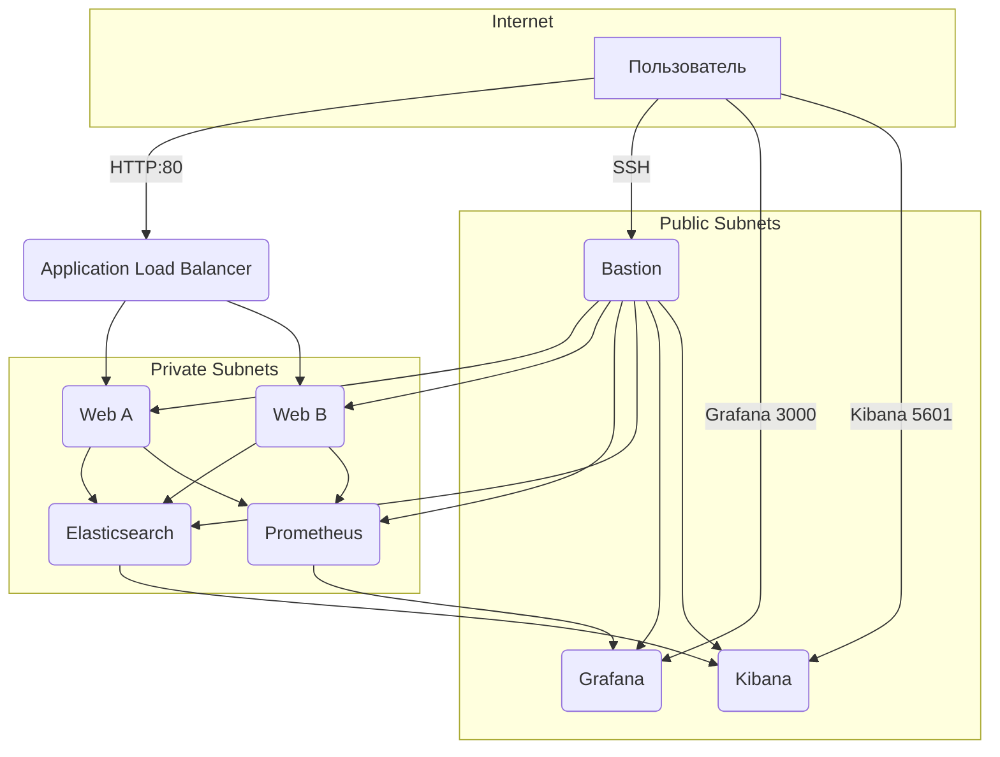

# Архитектура дипломного проекта

## Компоненты

- **VPC**: одна сеть `fops-diploma-network` с двумя публичными (`10.70.10.0/24`, `10.70.11.0/24`) и двумя приватными (`10.70.1.0/24`, `10.70.2.0/24`) подсетями в зонах `ru-central1-a/b`.
- **Bastion**: единственный хост с публичным IP, доступный по SSH только из `allowed_ssh_cidr`.
- **Web tier**: два идентичных nginx-хоста в разных зонах, трафик приходит с Application Load Balancer.
- **Мониторинг**: Prometheus (приватная подсеть) + Grafana (публичная подсеть, внешнее GUI).
- **Логи**: Elasticsearch (приватный хост) + Kibana (публичный GUI) + Filebeat + nginx-log-exporter на веб-серверах.
- **Резервное копирование**: единый snapshot schedule на все диски с TTL 7 дней.

## Диаграмма сети

## Таблица ролей ВМ

| Хост | Зона | Подсеть | Security Group | Порты | Назначение |
|------|------|---------|----------------|-------|------------|
| `bastion` | `ru-central1-a` | Public | `sg-bastion` | 22/tcp | SSH jump host |
| `web-ru-central1-a/b` | Private | `sg-web` | 22 (из bastion), 80 (из ALB), 4040/9100 | Nginx + exporters + filebeat |
| `prometheus` | Private | `sg-prometheus` | 22, 9090 (из Grafana) | Сбор метрик |
| `grafana` | Public | `sg-grafana` | 22, 3000 | Дашборды |
| `elasticsearch` | Private | `sg-elasticsearch` | 22, 9200 | Хранение логов |
| `kibana` | Public | `sg-kibana` | 22, 5601 | Просмотр логов |

## Связь Terraform ↔️ Ansible

- Terraform создаёт сеть, SG, ВМ, ALB и снапшоты и публикует IP-адреса через outputs.
- Скрипт `scripts/render-inventory.sh` читает `terraform output -json`, формирует статический JSON-inventory и автоматически прописывает ProxyCommand на bastion.
- Ansible роли используют `hostvars` и `groups` для генерации конфигов (Prometheus targets, Grafana datasource, Kibana/ Filebeat endpoints).

## Проверка соответствия требованиям

| Шаг | Требование | Проверка |
|-----|------------|----------|
| Сеть | 1 VPC, 2 зоны, bastion + подсети | `terraform plan` → выходные ресурсы; таблица маршрутов, NAT gateway |
| Сайт | 2 ВМ + ALB с healthcheck | `curl -v http://<alb_public_ip>/` (фиксируется в `docs/runbook.md`) |
| Мониторинг | Prometheus+Grafana, Exporters | `curl http://<prom>:9090/targets`, скрин Grafana USE dashboard |
| Логи | Elasticsearch+Kibana+Filebeat | `curl http://<kibana_public_ip>:5601`, `curl http://<es_ip>:9200/_cat/indices` |
| Сеть | Bastion-only SSH, SG ограничены | проверка sg rules `yc vpc security-group list` |
| Бекапы | Snapshot schedule 7d | `yc compute snapshot-schedule list` |
