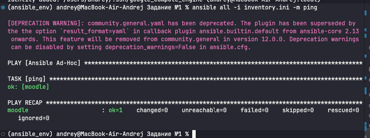
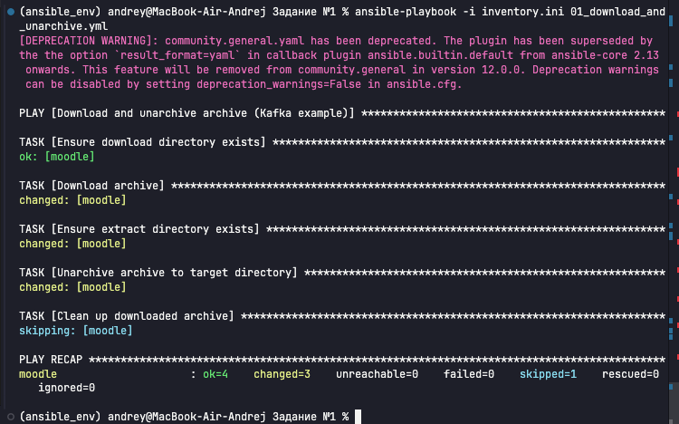
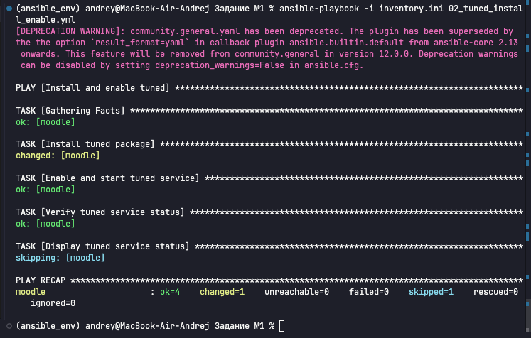
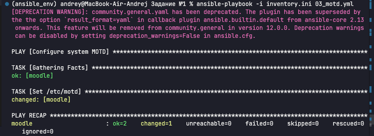
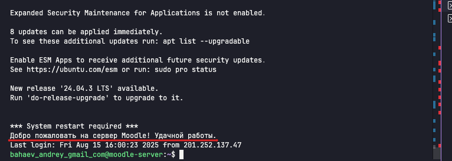

# Задание №1 - Выполнение трех плейбуков Ansible

## Описание
Выполнены три плейбука для автоматизации развертывания и настройки сервера:

1. **Скачивание и распаковка архива** (Apache Kafka)
2. **Установка и настройка tuned** 
3. **Настройка MOTD** (приветствие системы)

## Файлы конфигурации

### Ansible конфигурация
- [ansible.cfg](./ansible.cfg) - основная конфигурация Ansible
- [inventory.ini](./inventory.ini) - список управляемых хостов

### Плейбуки
- [01_download_and_unarchive.yml](./01_download_and_unarchive.yml) - скачивание и распаковка Kafka
- [02_tuned_install_enable.yml](./02_tuned_install_enable.yml) - установка и запуск tuned
- [03_motd.yml](./03_motd.yml) - настройка приветствия системы

## Результаты выполнения

### Тест подключения к серверу

### Плейбук №1: Скачивание и распаковка архива

**Результат:** 
- ✅ Создана директория для загрузки
- ✅ Скачан архив Apache Kafka 3.8.1
- ✅ Создана директория для распаковки
- ✅ Архив успешно распакован в `/opt/kafka/`

### Плейбук №2: Установка и настройка tuned

**Результат:**
- ✅ Установлен пакет tuned
- ✅ Запущен сервис tuned
- ✅ Добавлен в автозагрузку
- ✅ Проверен статус сервиса

### Плейбук №3: Настройка MOTD

**Результат:**
- ✅ Настроено приветствие системы
- ✅ Использована переменная для задания текста
- ✅ Файл `/etc/motd` успешно обновлен

## Итоги выполнения

Все три плейбука выполнены успешно:
- **Плейбук 1:** 4 задачи выполнены, 3 изменения
- **Плейбук 2:** 4 задачи выполнены, 1 изменение  
- **Плейбук 3:** 1 задача выполнена, 1 изменение

Все требования задания выполнены полностью.
