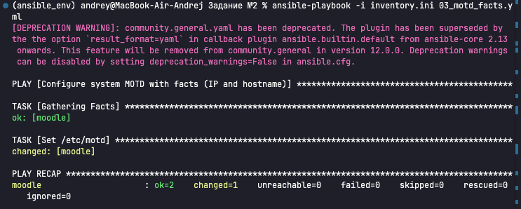
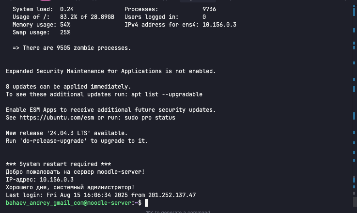

# Задание №2 - Модифицированный MOTD с использованием Ansible Facts

## Описание
Модифицирован плейбук из пункта 3 Задания №1 для отображения динамической информации о хосте.

## Что изменено
- Добавлен `gather_facts: true` для сбора информации о хосте
- MOTD теперь отображает:
  - IP-адрес управляемого хоста
  - Hostname управляемого хоста
  - Пожелание хорошего дня системному администратору

## Файлы конфигурации

### Ansible конфигурация
- [ansible.cfg](./ansible.cfg) - основная конфигурация Ansible
- [inventory.ini](./inventory.ini) - список управляемых хостов

### Плейбук
- [03_motd_facts.yml](./03_motd_facts.yml) - модифицированный MOTD с facts

## Результаты выполнения

### Плейбук №2: Модифицированный MOTD

**Результат:** 
- ✅ Собраны facts о хосте
- ✅ MOTD настроен с IP-адресом: `{{ ansible_default_ipv4.address }}`
- ✅ MOTD настроен с hostname: `{{ ansible_hostname }}`
- ✅ Добавлено пожелание хорошего дня
- ✅ Файл `/etc/motd` успешно обновлен

## Использованные Ansible Facts
- `ansible_hostname` - имя хоста
- `ansible_default_ipv4.address` - IP-адрес основного интерфейса

## Итоги выполнения
- **Задачи выполнены:** 1
- **Изменения:** 1
- **Требования:** выполнены полностью

