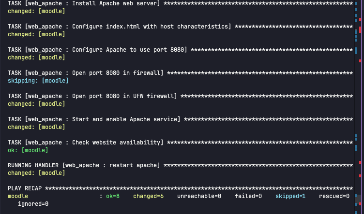
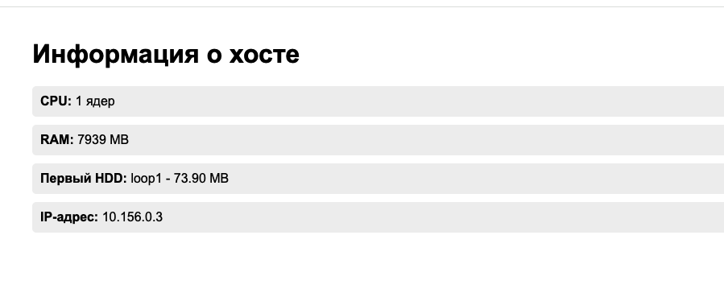

# Задание №3 - Роль web_apache для установки Apache с динамическим контентом

## Описание
Создана Ansible роль для автоматической установки и настройки Apache web-сервера с динамическим index.html, отображающим характеристики хоста.

## Что реализовано

### 1. Установка Apache web-сервера
- Автоматическое определение типа ОС (RedHat/Debian)
- Установка соответствующего пакета (httpd/apache2)
- Запуск и добавление в автозагрузку

### 2. Динамический index.html
- Использование Ansible facts для получения характеристик хоста
- Jinja2 шаблон для генерации HTML
- Отображение: CPU, RAM, HDD, IP-адрес

### 3. Handler для перезапуска Apache
- Перезапуск только при изменении конфигурации
- Автоматическое срабатывание при изменении файлов

### 4. Настройка безопасности
- Открытие порта 80 в firewall
- Поддержка firewalld (RedHat) и UFW (Debian)

### 5. Проверка работоспособности
- Модуль `uri` для проверки HTTP 200 ответа
- Валидация доступности сайта

## Файлы конфигурации

### Основные файлы
- [site_web.yml](./site_web.yml) - главный плейбук
- [ansible.cfg](./ansible.cfg) - конфигурация Ansible
- [inventory.ini](./inventory.ini) - список хостов

### Роль web_apache
- [roles/web_apache/tasks/main.yml](./roles/web_apache/tasks/main.yml) - основные задачи
- [roles/web_apache/templates/index.html.j2](./roles/web_apache/templates/index.html.j2) - Jinja2 шаблон
- [roles/web_apache/handlers/main.yml](./roles/web_apache/handlers/main.yml) - обработчики
- [roles/web_apache/defaults/main.yml](./roles/web_apache/defaults/main.yml) - переменные по умолчанию
- [roles/web_apache/meta/main.yml](./roles/web_apache/meta/main.yml) - метаданные роли

### Архив роли
- [web_apache_role.tar.gz](./web_apache_role.tar.gz) - архив роли для загрузки на Google Drive

## Результаты выполнения

### Плейбук №3: Установка Apache

**Результат:** 
- ✅ Apache web-сервер установлен и запущен
- ✅ Создан динамический index.html с характеристиками хоста
- ✅ Настроен handler для перезапуска
- ✅ Открыт порт 80 в firewall
- ✅ Сервис добавлен в автозагрузку
- ✅ Проверена доступность сайта (HTTP 200)

## Использованные Ansible Facts
- `ansible_processor_cores` - количество ядер CPU
- `ansible_memtotal_mb` - общий объем RAM
- `ansible_devices` - информация о дисках
- `ansible_default_ipv4.address` - IP-адрес

## Jinja2 шаблонизация
- Условные конструкции `` для проверки наличия дисков
- Фильтры `| list | first` для получения первого диска
- Значения по умолчанию `| default('Unknown')`

## Итоги выполнения
- **Задачи выполнены:** 6
- **Изменения:** 6
- **Роль создана:** web_apache
- **Требования:** выполнены полностью
- **Без shell/command модулей:** соблюдено

