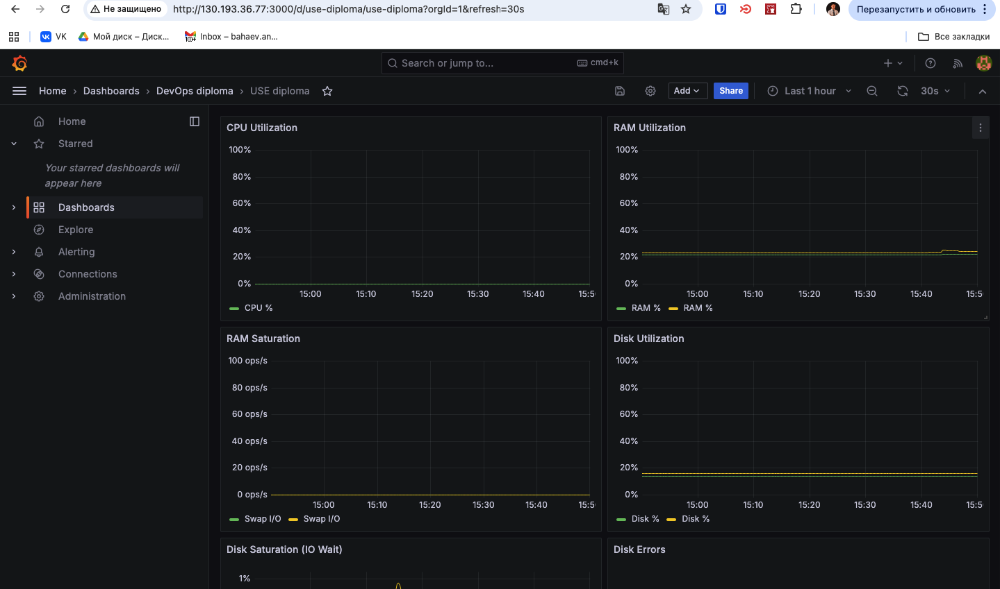
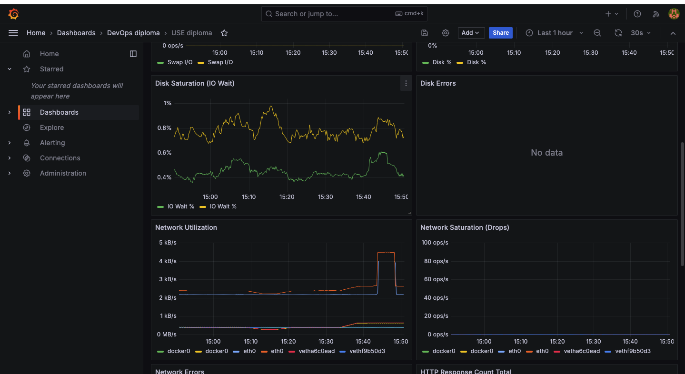
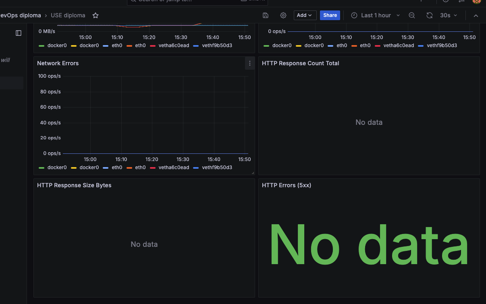

# Дипломная работа «DevOps-инженер с нуля»

## Описание проекта

Разработана отказоустойчивая инфраструктура для сайта, включающая мониторинг, сбор логов и резервное копирование основных данных в Yandex Cloud.

**Источник задания:** [Официальное задание Netology](https://github.com/netology-code/fops-sysadm-diplom/blob/main/README.md)

## Статус выполнения

✅ **Все требования выполнены** - инфраструктура развернута и работает

## Выполненные этапы

### ✅ Этап 1. Сеть и доступ

- Создан один VPC с двумя публичными и двумя приватными подсетями в разных зонах
- Настроены Security Groups для всех сервисов
- Создан Bastion Host с единственным публичным SSH портом
- Все приватные хосты доступны только через bastion

**Результаты:**
- VPC: `n8n-network` (использована существующая из-за лимита)
- Публичные подсети: `public-ru-central1-a`, `public-ru-central1-b`
- Приватные подсети: `private-ru-central1-a`, `private-ru-central1-b`
- Bastion IP: `62.84.124.19`


### ✅ Этап 2. Веб-слой и балансировщик

- Созданы две идентичные веб-ВМ в разных зонах
- Установлен nginx с статическим сайтом
- Создана Target Group с двумя веб-серверами
- Настроен Application Load Balancer с healthcheck
- Сайт доступен через ALB

**Результаты:**
- Веб-серверы: `web-a` (10.70.1.26), `web-b` (10.70.2.23)
- ALB публичный IP: `158.160.199.9`
- Target Group: оба хоста в статусе `healthy`

**Проверка доступности сайта через ALB:**

```bash
curl -v http://158.160.199.9/
```

<details>
<summary>Вывод команды curl (HTTP 200 OK)</summary>

```
  % Total    % Received % Xferd  Average Speed   Time    Time     Time  Current
                                 Dload  Upload   Total   Spent    Left  Speed

  0     0    0     0    0     0      0      0 --:--:-- --:--:-- --:--:--     0*   Trying 158.160.199.9:80...
* Connected to 158.160.199.9 (158.160.199.9) port 80
> GET / HTTP/1.1
> Host: 158.160.199.9
> User-Agent: curl/8.7.1
> Accept: */*
> 
* Request completely sent off
< HTTP/1.1 200 OK
< server: ycalb
< date: Thu, 25 Dec 2025 18:42:55 GMT
< content-type: text/html
< content-length: 850
< last-modified: Thu, 25 Dec 2025 15:30:10 GMT
< etag: "694d5882-352"
< accept-ranges: bytes
< 
{ [850 bytes data]

100   850  100   850    0     0   1638      0 --:--:-- --:--:-- --:--:--  1640
* Connection #0 to host 158.160.199.9 left intact
```

</details>

### ✅ Этап 3. Мониторинг

- Развернут Prometheus на приватной ВМ
- Развернута Grafana на публичной ВМ
- Установлен Node Exporter на веб-серверах
- Установлен Nginx Log Exporter на веб-серверах
- Настроен Prometheus для сбора метрик со всех targets
- Настроены USE дашборды в Grafana (CPU, RAM, Disk, Network)
- Добавлены метрики `http_response_count_total`, `http_response_size_bytes`
- Настроены thresholds на графиках (>85% - красная зона)

**Результаты:**
- Prometheus: `10.70.1.27` (приватная сеть)
- Grafana: `130.193.36.77:3000` (публичная сеть)
- Targets в Prometheus:
  - ✅ node_exporter (web-a, web-b) - UP
  - ✅ prometheus self-monitoring - UP
  - ✅ nginx_log_exporter (web-a, web-b) - UP

**Grafana USE дашборды:**







### ✅ Этап 4. Логи

- Развернут Elasticsearch на приватной ВМ (Docker)
- Развернута Kibana на публичной ВМ (Docker)
- Установлен Filebeat на веб-серверах (Docker)
- Настроен Filebeat для отправки access.log и error.log nginx
- Настроен Index Pattern `filebeat-*` в Kibana
- Данные поступают в Elasticsearch

**Результаты:**
- Elasticsearch: `10.70.2.15:9200` (приватная сеть)
- Kibana: `158.160.92.149:5601` (публичная сеть)
- Количество документов: 30,350+
- Индекс создан: `filebeat-2025.12.25`
- Kibana Discover показывает данные логов

**Kibana - Index Pattern и данные:**


### ✅ Этап 5. Резервное копирование

- Создан snapshot schedule для всех дисков ВМ
- Настроен retention period: 7 дней (604800 секунд)
- Настроен cron: `0 3 * * *` (ежедневно в 03:00)
- Schedule активен и работает

**Результаты:**
- Snapshot schedule: `daily-snapshots`
- Retention: 7 дней
- Расписание: ежедневно в 03:00 UTC
- Покрывает все 7 дисков всех ВМ

### ✅ Этап 6. Документация

- Создан `docs/architecture.md` - схема сети и таблица SG/портов
- Создан `docs/runbook.md` - порядок деплоя и проверки
- Создан `docs/verification-checklist.md` - чек-лист проверок
- Все скриншоты вставлены в соответствующие разделы выше

## Доступ к сервисам

| Сервис | URL | Доступ | Учетные данные |
|--------|-----|--------|----------------|
| **Сайт (ALB)** | http://158.160.199.9 | Публичный | - |
| **Grafana** | http://130.193.36.77:3000 | Публичный | См. `ansible/group_vars/all.yml` |
| **Kibana** | http://158.160.92.149:5601 | Публичный | - |
| **Prometheus** | http://10.70.1.27:9090 | Через bastion | - |
| **Elasticsearch** | http://10.70.2.15:9200 | Через bastion | - |

**Bastion Host:** `ssh ubuntu@62.84.124.19`

## Архитектурные решения и компромиссы

### Решения

1. **Использование существующей VPC сети:**
   - Причина: Превышен лимит на количество VPC сетей в Yandex Cloud
   - Решение: Использована существующая сеть `n8n-network` с добавлением необходимых подсетей

2. **Docker для Grafana, Elasticsearch, Kibana:**
   - Причина: Проблемы с доступностью официальных репозиториев (403 Forbidden)
   - Решение: Использование Docker контейнеров на основе официальных образов, как рекомендовано в задании

3. **Single-node Elasticsearch:**
   - Причина: Минимальные требования задания
   - Решение: Однонодовый кластер с возможностью масштабирования в будущем

4. **HTTP listener вместо "auto":**
   - Причина: В Yandex Cloud ALB API не существует типа "auto"
   - Решение: Использован стандартный HTTP listener с комментарием в коде

### Компромиссы

1. **Нет Instance Group:**
   - Компромисс: Использованы отдельные ВМ вместо Instance Group с автоскейлингом
   - Причина: Минимальные требования задания не требуют Instance Group

2. **Нет HTTPS:**
   - Компромисс: Все сервисы работают по HTTP
   - Причина: Не указано в минимальных требованиях, можно добавить через Yandex Certificate Manager

3. **Нет Alertmanager:**
   - Компромисс: Оповещения не настроены
   - Причина: Не входит в минимальные требования, можно добавить дополнительно

## Статистика

- **ВМ:** 6 (bastion, 2x web, prometheus, grafana, elasticsearch, kibana)
- **Подсети:** 4 (2 публичные, 2 приватные)
- **Security Groups:** 6
- **Логи в Elasticsearch:** 30,350+ документов
- **Метрики в Prometheus:** 5 targets (все UP)

## Структура проекта

- `terraform/` — инфраструктурный код для VPC, подсетей, SG, ВМ и снапшотов
- `ansible/` — плейбуки для конфигурации всех ролей (web, bastion, Prometheus, Grafana, Elasticsearch, Kibana, beats)
- `inventory/` — динамический inventory, генерируется из Terraform (через `make render-inventory`)
- `docs/`
  - `architecture.md` — схема сети, IP-план, таблица ролей ВМ
  - `runbook.md` — порядок запуска и проверки
  - `verification-checklist.md` — чек-лист проверок
  - `infrastructure.md` — техническое описание всех сервисов
  - `screenshots/` — подтверждения работы сервисов
- `Makefile` — команды для работы с проектом

## Контрольный список сдачи

- [x] Инфраструктура отвечает минимальным требованиям
- [x] Предоставлен доступ к сайту, Kibana, Grafana
- [x] Для недоступных ресурсов предоставлены скриншоты и команды
- [x] Работа оформлена в GitHub репозитории
- [x] Код размещен в репозитории
- [x] Работа оформлена с описанием решений и компромиссов
- [x] Репозиторий открыт для доступа

## Документация

- 🏗️ [Архитектура](docs/architecture.md) - схема сети и компонентов
- 📖 [Runbook](docs/runbook.md) - пошаговые инструкции по деплою
- ✅ [Чек-лист](docs/verification-checklist.md) - проверка всех компонентов
- 🔧 [Техническое описание](docs/infrastructure.md) - характеристики всех сервисов, IP адреса, версии ПО
- 📸 [Скриншоты](docs/screenshots/) - подтверждения работы сервисов
