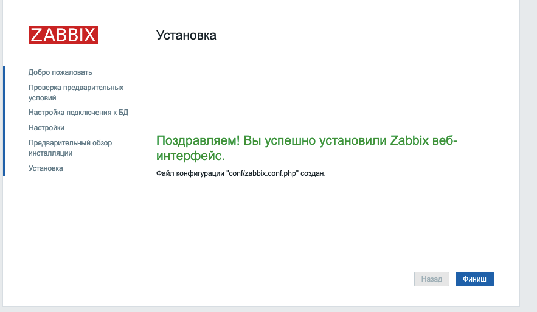
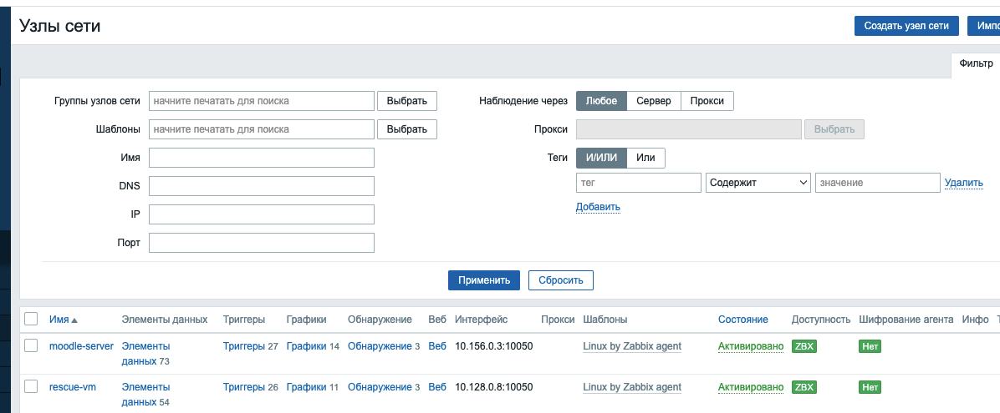

# Домашнее задание к занятию "Система мониторинга Zabbix" - Бахаев Андрей


### Инструкция по выполнению домашнего задания

   1. Сделайте `fork` данного репозитория к себе в Github и переименуйте его по названию или номеру занятия, например, https://github.com/имя-вашего-репозитория/zabbix-hw или  https://github.com/имя-вашего-репозитория/hw-02-monitoring).
   2. Выполните клонирование данного репозитория к себе на ПК с помощью команды `git clone`.
   3. Выполните домашнее задание и заполните у себя локально этот файл README.md:
      - впишите вверху название занятия и вашу фамилию и имя
      - в каждом задании добавьте решение в требуемом виде (текст/код/скриншоты/ссылка)
      - для корректного добавления скриншотов воспользуйтесь [инструкцией "Как вставить скриншот в шаблон с решением](https://github.com/netology-code/sys-pattern-homework/blob/main/screen-instruction.md)
      - при оформлении используйте возможности языка разметки md (коротко об этом можно посмотреть в [инструкции  по MarkDown](https://github.com/netology-code/sys-pattern-homework/blob/main/md-instruction.md))
   4. После завершения работы над домашним заданием сделайте коммит (`git commit -m "comment"`) и отправьте его на Github (`git push origin`);
   5. Для проверки домашнего задания преподавателем в личном кабинете прикрепите и отправьте ссылку на решение в виде md-файла в вашем Github.
   6. Любые вопросы по выполнению заданий спрашивайте в чате учебной группы и/или в разделе "Вопросы по заданию" в личном кабинете.
   
Желаем успехов в выполнении домашнего задания!
   
### Дополнительные материалы, которые могут быть полезны для выполнения задания

1. [Руководство по оформлению Markdown файлов](https://gist.github.com/Jekins/2bf2d0638163f1294637#Code)
2. [Официальная документация Zabbix](https://www.zabbix.com/documentation/current/ru/manual)
3. [Конфигуратор команд Zabbix](https://www.zabbix.com/download)

---

### Задание 1 - Установка Zabbix Server с веб-интерфейсом

Установил Zabbix Server с веб-интерфейсом на сервер moodle-server в Google Cloud.

#### Процесс выполнения:
1. Подключился к серверу moodle-server через gcloud compute ssh
2. Установил PostgreSQL из системного репозитория Ubuntu
3. Добавил официальный репозиторий Zabbix 6.0 LTS
4. Установил Zabbix Server, веб-интерфейс и агент
5. Создал базу данных и пользователя zabbix в PostgreSQL
6. Импортировал схему базы данных Zabbix
7. Настроил пароль БД в конфигурации сервера
8. Запустил и настроил автозапуск сервисов
9. Настроил nginx как прокси для веб-интерфейса

#### Использованные команды:

```bash
# Подключение к серверу
gcloud compute ssh moodle-server --zone europe-west3-c

# Установка базовых пакетов и PostgreSQL
sudo apt update
sudo apt install -y postgresql postgresql-contrib wget gnupg lsb-release openssl

# Добавление репозитория Zabbix
VERSION_ID=$(awk -F= '/^VERSION_ID/{gsub(/"/,"");print $2}' /etc/os-release)
wget -q https://repo.zabbix.com/zabbix/6.0/ubuntu/pool/main/z/zabbix-release/zabbix-release_6.0-4+ubuntu${VERSION_ID}_all.deb
sudo dpkg -i zabbix-release_6.0-4+ubuntu${VERSION_ID}_all.deb
sudo apt update

# Установка компонентов Zabbix
sudo apt install -y zabbix-server-pgsql zabbix-frontend-php php-pgsql zabbix-apache-conf zabbix-sql-scripts zabbix-agent2

# Создание пароля БД
sudo install -d -m 700 -o root -g root /etc/zabbix/.secrets
sudo sh -c "umask 077; openssl rand -base64 48 > /etc/zabbix/.secrets/db_password"
ZABBIX_DB_PASSWORD=$(sudo cat /etc/zabbix/.secrets/db_password)

# Создание пользователя и БД
sudo -u postgres psql -v ON_ERROR_STOP=1 <<SQL
DO \$\$ BEGIN
   IF NOT EXISTS (SELECT FROM pg_roles WHERE rolname = 'zabbix') THEN
      CREATE ROLE zabbix LOGIN PASSWORD '${ZABBIX_DB_PASSWORD}';
   END IF;
END \$\$;
SQL
sudo -u postgres createdb -O zabbix zabbix

# Импорт схемы БД
zcat /usr/share/zabbix-sql-scripts/postgresql/server.sql.gz | sudo -u postgres psql -v ON_ERROR_STOP=1 -d zabbix

# Настройка пароля в конфиге
ESCAPED=$(printf '%s' "${ZABBIX_DB_PASSWORD}" | sed -e 's/[\\/&]/\\&/g')
sudo sed -i "s/^#\?\s*DBPassword=.*/DBPassword=${ESCAPED}/" /etc/zabbix/zabbix_server.conf || true
grep -q '^DBPassword=' /etc/zabbix/zabbix_server.conf || echo "DBPassword=${ZABBIX_DB_PASSWORD}" | sudo tee -a /etc/zabbix/zabbix_server.conf >/dev/null

# Запуск сервисов
sudo systemctl enable --now zabbix-server zabbix-agent2 apache2

# Настройка nginx как прокси
sudo nano /etc/nginx/sites-available/zabbix
# Добавил конфигурацию прокси для /zabbix/
sudo ln -sf /etc/nginx/sites-available/zabbix /etc/nginx/sites-enabled/
sudo nginx -t
sudo systemctl reload nginx
```

#### Скриншот авторизации в админке:


---

### Задание 2 - Установка Zabbix Agent на два хоста

Установил Zabbix Agent2 на серверы moodle-server и rescue-vm и подключил их к серверу Zabbix.

#### Процесс выполнения:
1. Настроил агент на moodle-server (уже был установлен)
2. Установил агент на rescue-vm
3. Настроил конфигурацию агентов для подключения к серверу Zabbix
4. Добавил хосты в веб-интерфейсе Zabbix
5. Проверил получение данных от агентов

#### Использованные команды:

```bash
# Настройка агента на moodle-server
SERVER_IP="10.156.0.3"
HOSTNAME="moodle-server"
sudo sed -i "s/^Server=127.0.0.1/Server=${SERVER_IP}/" /etc/zabbix/zabbix_agent2.conf
sudo sed -i "s/^ServerActive=127.0.0.1/ServerActive=${SERVER_IP}/" /etc/zabbix/zabbix_agent2.conf
sudo sed -i "s/^Hostname=Zabbix server/Hostname=${HOSTNAME}/" /etc/zabbix/zabbix_agent2.conf
sudo systemctl restart zabbix-agent2

# Установка агента на rescue-vm
gcloud compute ssh rescue-vm --zone us-central1-a
sudo apt update
sudo apt install -y wget gnupg lsb-release
VERSION_ID=$(awk -F= '/^VERSION_ID/{gsub(/"/,"");print $2}' /etc/os-release)
wget -q https://repo.zabbix.com/zabbix/6.0/ubuntu/pool/main/z/zabbix-release/zabbix-release_6.0-4+ubuntu${VERSION_ID}_all.deb
sudo dpkg -i zabbix-release_6.0-4+ubuntu${VERSION_ID}_all.deb
sudo apt update
sudo apt install -y zabbix-agent2

# Настройка агента на rescue-vm
SERVER_IP="10.156.0.3"
HOSTNAME="rescue-vm"
sudo sed -i "s/^Server=127.0.0.1/Server=${SERVER_IP}/" /etc/zabbix/zabbix_agent2.conf
sudo sed -i "s/^ServerActive=127.0.0.1/ServerActive=${SERVER_IP}/" /etc/zabbix/zabbix_agent2.conf
sudo sed -i "s/^Hostname=Zabbix server/Hostname=${HOSTNAME}/" /etc/zabbix/zabbix_agent2.conf
sudo systemctl enable --now zabbix-agent2
```

#### Скриншоты:

**Configuration > Hosts - агенты подключены:**


**Лог агента на moodle-server:**


**Лог агента на rescue-vm:**


**Monitoring > Latest data:**


---

## Результат выполнения

✅ **Задание 1 выполнено:** Zabbix Server установлен и работает с веб-интерфейсом на порту 8080 через nginx прокси

✅ **Задание 2 выполнено:** Zabbix Agent2 установлен и работает на двух хостах:
- moodle-server (10.156.0.3:10050)
- rescue-vm (10.128.0.8:10050)

Оба агента успешно подключены к серверу Zabbix и передают данные мониторинга.