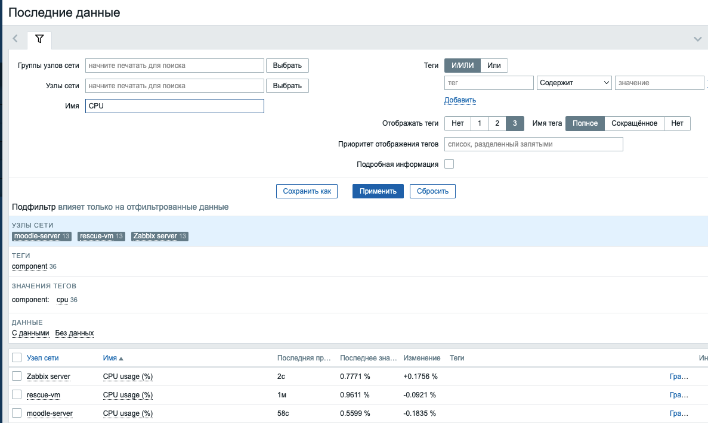
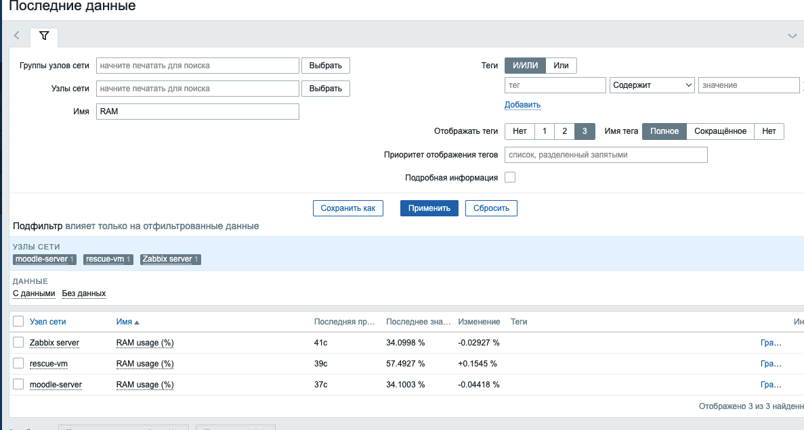
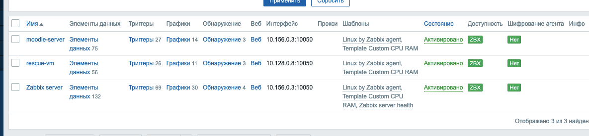

# Домашнее задание к занятию "Система мониторинга Zabbix. Часть 2" — Бахаев Андрей

## Содержание
- Задание 1 — шаблон CPU/RAM
- Задание 2–3 — привязка шаблонов к хостам
- Задание 4 — кастомный дашборд

## Задание 1 — создать шаблон с метриками CPU и RAM
- Создан шаблон `Template Custom CPU RAM`.
- Элементы данных:
  - CPU usage (%) — вычисляемый элемент: `100 - last(//system.cpu.util[,idle,avg1])`, единицы `%`.
  - RAM usage (%) — `vm.memory.size[pused]` (тип: Числовой с плавающей точкой, единицы `%`).
- Скриншоты:
  - Страница шаблона: 
  - Графики по CPU: 
  - Графики по RAM: 

## Задание 2–3 — добавить 2 хоста и привязать шаблоны
- Хосты: `moodle-server` и `rescue-vm` (оба с зелёным ZBX).
- Привязаны шаблоны:
  - `Linux by Zabbix agent`
  - `Template Custom CPU RAM`
- Данные приходят в Latest data (CPU/RAM).
- Скрин: привязанные шаблоны к хостам — 

## Задание 4 — кастомный дашборд
- Создан дашборд с виджетами:
  - График: CPU usage (%) и RAM usage (%) для `moodle-server` и `rescue-vm`.
  - Доступность узлов сети.
  - Информация о системе.
- Скрин: 

## Источник задания
Оригинал hw-03: https://github.com/netology-code/smon-homeworks/blob/main/hw-03.md
