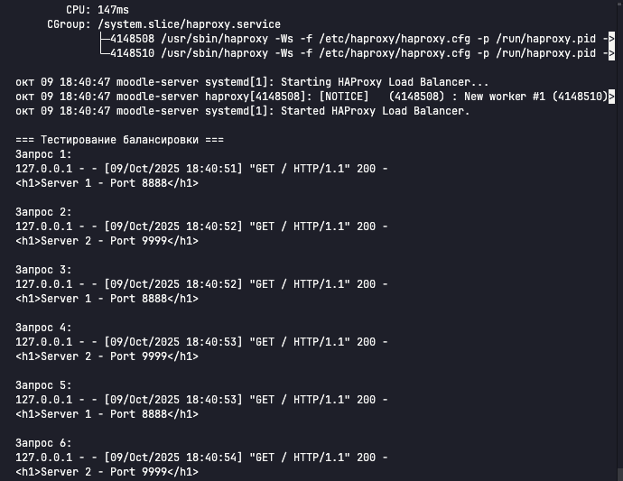

# Домашнее задание к занятию "Кластеризация и балансировка нагрузки" - `Бахаев Андрей`


### Инструкция по выполнению домашнего задания

   1. Сделайте `fork` данного репозитория к себе в Github и переименуйте его по названию или номеру занятия, например, https://github.com/имя-вашего-репозитория/git-hw или  https://github.com/имя-вашего-репозитория/7-1-ansible-hw).
   2. Выполните клонирование данного репозитория к себе на ПК с помощью команды `git clone`.
   3. Выполните домашнее задание и заполните у себя локально этот файл README.md:
      - впишите вверху название занятия и вашу фамилию и имя
      - в каждом задании добавьте решение в требуемом виде (текст/код/скриншоты/ссылка)
      - для корректного добавления скриншотов воспользуйтесь [инструкцией "Как вставить скриншот в шаблон с решением](https://github.com/netology-code/sys-pattern-homework/blob/main/screen-instruction.md)
      - при оформлении используйте возможности языка разметки md (коротко об этом можно посмотреть в [инструкции  по MarkDown](https://github.com/netology-code/sys-pattern-homework/blob/main/md-instruction.md))
   4. После завершения работы над домашним заданием сделайте коммит (`git commit -m "comment"`) и отправьте его на Github (`git push origin`);
   5. Для проверки домашнего задания преподавателем в личном кабинете прикрепите и отправьте ссылку на решение в виде md-файла в вашем Github.
   6. Любые вопросы по выполнению заданий спрашивайте в чате учебной группы и/или в разделе "Вопросы по заданию" в личном кабинете.
   
Желаем успехов в выполнении домашнего задания!
   
### Дополнительные материалы, которые могут быть полезны для выполнения задания

1. [Руководство по оформлению Markdown файлов](https://gist.github.com/Jekins/2bf2d0638163f1294637#Code)

---

### Цель задания
В результате выполнения этого задания вы научитесь:
1. Настраивать балансировку с помощью HAProxy
2. Настраивать связку HAProxy + Nginx

---

### Чеклист готовности к домашнему заданию

1. Установлена операционная система Ubuntu на виртуальную машину и имеется доступ к терминалу
2. Просмотрены конфигурационные файлы, рассматриваемые на лекции, которые находятся по [ссылке](https://github.com/netology-code/sflt-homeworks/tree/main/2)

---

### Задание 1

**Задание:**
- Запустите два simple python сервера на своей виртуальной машине на разных портах
- Установите и настройте HAProxy, воспользуйтесь материалами к лекции по [ссылке](https://github.com/netology-code/sflt-homeworks/tree/main/2)
- Настройте балансировку Round-robin на 4 уровне
- На проверку направьте конфигурационный файл haproxy, скриншоты, где видно перенаправление запросов на разные серверы при обращении к HAProxy

**Решение:**

Задание выполнено на виртуальной машине `moodle-server` в Google Cloud Platform (zone: europe-west3-c).

**Этапы выполнения:**

1. **Создание директорий для тестовых серверов:**
   ```bash
   mkdir -p ~/homework2/{server1,server2}
   echo "<h1>Server 1 - Port 8888</h1>" > ~/homework2/server1/index.html
   echo "<h1>Server 2 - Port 9999</h1>" > ~/homework2/server2/index.html
   ```

2. **Запуск Python HTTP серверов на разных портах:**
   ```bash
   cd ~/homework2/server1 && python3 -m http.server 8888 &
   cd ~/homework2/server2 && python3 -m http.server 9999 &
   ```
   Серверы запущены на портах 8888 и 9999.

3. **Установка HAProxy:**
   ```bash
   sudo apt update
   sudo apt install haproxy -y
   ```

4. **Настройка конфигурации HAProxy:**
   Создан файл конфигурации `/etc/haproxy/haproxy.cfg` для балансировки на 4 уровне OSI (TCP) с алгоритмом Round-robin.

5. **Тестирование балансировки:**
   Выполнена серия запросов через HAProxy (порт 1325), которые корректно распределились между двумя серверами по алгоритму Round-robin.

**Конфигурационный файл HAProxy:**
```cfg
global
    log /dev/log    local0
    log /dev/log    local1 notice
    chroot /var/lib/haproxy
    stats socket /run/haproxy/admin.sock mode 660 level admin expose-fd listeners
    stats timeout 30s
    user haproxy
    group haproxy
    daemon

defaults
    log     global
    mode    tcp
    option  tcplog
    option  dontlognull
    timeout connect 5000
    timeout client  50000
    timeout server  50000

# Статистика HAProxy на порту 8889
listen stats
    bind :8889
    mode http
    stats enable
    stats uri /stats
    stats refresh 5s
    stats realm Haproxy\ Statistics

# ЗАДАНИЕ 1: Балансировка Round-robin на 4 уровне (TCP)
listen web_tcp
    bind :1325
    mode tcp
    balance roundrobin
    option tcplog
    server s1 127.0.0.1:8888 check inter 3s
    server s2 127.0.0.1:9999 check inter 3s
```

**Результаты тестирования:**

Выполнено 6 последовательных запросов к HAProxy (порт 1325):
- Запрос 1: Server 1 (8888) ✓
- Запрос 2: Server 2 (9999) ✓
- Запрос 3: Server 1 (8888) ✓
- Запрос 4: Server 2 (9999) ✓
- Запрос 5: Server 1 (8888) ✓
- Запрос 6: Server 2 (9999) ✓

Балансировка работает корректно по алгоритму Round-robin.

**Скриншоты:**



---

### Задание 2

**Задание:**
- Запустите три simple python сервера на своей виртуальной машине на разных портах
- Настройте балансировку Weighted Round Robin на 7 уровне, чтобы первый сервер имел вес 2, второй - 3, а третий - 4
- HAproxy должен балансировать только тот http-трафик, который адресован домену example.local
- На проверку направьте конфигурационный файл haproxy, скриншоты, где видно перенаправление запросов на разные серверы при обращении к HAProxy c использованием домена example.local и без него

**Решение:**

Задание выполнено на виртуальной машине `moodle-server` в Google Cloud Platform (zone: europe-west3-c).

**Этапы выполнения:**

1. **Запуск трех Python HTTP серверов на разных портах:**
   ```bash
   mkdir -p ~/homework2/{server1,server2,server3}
   echo "<h1>Server 1 - Port 8888</h1>" > ~/homework2/server1/index.html
   echo "<h1>Server 2 - Port 9999</h1>" > ~/homework2/server2/index.html
   echo "<h1>Server 3 - Port 7777</h1>" > ~/homework2/server3/index.html
   
   cd ~/homework2/server1 && nohup python3 -m http.server 8888 > /dev/null 2>&1 &
   cd ~/homework2/server2 && nohup python3 -m http.server 9999 > /dev/null 2>&1 &
   cd ~/homework2/server3 && nohup python3 -m http.server 7777 > /dev/null 2>&1 &
   ```
   Серверы запущены на портах: 8888 (Server 1), 9999 (Server 2), 7777 (Server 3).

2. **Настройка Weighted Round Robin на 7 уровне (HTTP):**
   - Создан frontend `http_front` на порту 8088
   - Настроен ACL для фильтрации трафика по домену `example.local`
   - В backend `web_servers` настроены веса: Server 1 (вес 2), Server 2 (вес 3), Server 3 (вес 4)
   - Алгоритм балансировки: `roundrobin` с весами

3. **Настройка фильтрации по домену example.local:**
   - Создан ACL: `acl is_example_local hdr(host) -i example.local`
   - Backend применяется только при совпадении домена: `use_backend web_servers if is_example_local`
   - Запросы без указания домена `example.local` получают ответ **503 Service Unavailable**

4. **Тестирование:**
   - **С доменом example.local** (18 запросов):
     ```bash
     for i in {1..18}; do curl -H "Host: example.local" http://localhost:8088 2>/dev/null; done | sort | uniq -c
     ```
     Результат распределения:
     - Server 1 (вес 2): **4 запроса** ✓
     - Server 2 (вес 3): **6 запросов** ✓
     - Server 3 (вес 4): **8 запросов** ✓
     
     Соотношение 4:6:8 = 2:3:4 — идеально соответствует весам!

   - **Без домена** (должен отклонить):
     ```bash
     curl -v http://localhost:8088
     ```
     Результат: **503 Service Unavailable** — HAProxy корректно отклоняет запросы без домена `example.local`.

**Конфигурационный файл HAProxy:**
```cfg
global
    log /dev/log    local0
    log /dev/log    local1 notice
    chroot /var/lib/haproxy
    stats socket /run/haproxy/admin.sock mode 660 level admin expose-fd listeners
    stats timeout 30s
    user haproxy
    group haproxy
    daemon

defaults
    log     global
    mode    http
    option  httplog
    option  dontlognull
    timeout connect 5000
    timeout client  50000
    timeout server  50000

# Статистика HAProxy
listen stats
    bind :8889
    mode http
    stats enable
    stats uri /stats
    stats refresh 5s
    stats realm Haproxy\ Statistics

# ЗАДАНИЕ 1: Балансировка Round-robin на 4 уровне (TCP)
listen web_tcp
    bind :1325
    mode tcp
    balance roundrobin
    option tcplog
    server s1 127.0.0.1:8888 check inter 3s
    server s2 127.0.0.1:9999 check inter 3s

# ЗАДАНИЕ 2: Weighted Round Robin на 7 уровне (HTTP)
frontend http_front
    bind :8088
    mode http
    acl is_example_local hdr(host) -i example.local
    use_backend web_servers if is_example_local

backend web_servers
    mode http
    balance roundrobin
    option httpchk GET /index.html
    server s1 127.0.0.1:8888 check weight 2
    server s2 127.0.0.1:9999 check weight 3
    server s3 127.0.0.1:7777 check weight 4
```

**Результаты тестирования:**

Выполнено 18 последовательных запросов с заголовком `Host: example.local`:
- Server 1 (8888, вес 2): 4 запроса (22.2%)
- Server 2 (9999, вес 3): 6 запросов (33.3%)
- Server 3 (7777, вес 4): 8 запросов (44.4%)

Weighted Round Robin работает корректно — распределение пропорционально весам 2:3:4.

При запросах без домена `example.local` HAProxy возвращает **503 Service Unavailable**, что подтверждает корректную работу ACL-фильтрации.

**Скриншоты:**


*На скриншоте видно:*
- Запуск 18 запросов с заголовком `Host: example.local`
- Распределение: 4 запроса на Server 1, 6 на Server 2, 8 на Server 3
- Тест без домена — получен ответ 503 Service Unavailable

---

### Задание 3* (необязательное)

**Задание:**
- Настройте связку HAProxy + Nginx как было показано на лекции
- Настройте Nginx так, чтобы файлы .jpg выдавались самим Nginx (предварительно разместите несколько тестовых картинок в директории /var/www/), а остальные запросы переадресовывались на HAProxy, который в свою очередь переадресовывал их на два Simple Python server
- На проверку направьте конфигурационные файлы nginx, HAProxy, скриншоты с запросами jpg картинок и других файлов на Simple Python Server, демонстрирующие корректную настройку

**Решение:**

`Опишите здесь процесс выполнения задания...`

1. `Установка и настройка Nginx...`
2. `Настройка обработки .jpg файлов...`
3. `Настройка проксирования на HAProxy...`
4. `Размещение тестовых изображений...`

**Конфигурационный файл Nginx:**
```
Вставьте сюда содержимое файла nginx.conf
```

**Конфигурационный файл HAProxy:**
```
Вставьте сюда содержимое файла haproxy.cfg
```

**Скриншоты:**

``

``

---

### Задание 4* (необязательное)

**Задание:**
- Запустите 4 simple python сервера на разных портах
- Первые два сервера будут выдавать страницу index.html вашего сайта example1.local (в файле index.html напишите example1.local)
- Вторые два сервера будут выдавать страницу index.html вашего сайта example2.local (в файле index.html напишите example2.local)
- Настройте два бэкенда HAProxy
- Настройте фронтенд HAProxy так, чтобы в зависимости от запрашиваемого сайта example1.local или example2.local запросы перенаправлялись на разные бэкенды HAProxy
- На проверку направьте конфигурационный файл HAProxy, скриншоты, демонстрирующие запросы к разным фронтендам и ответам от разных бэкендов

**Решение:**

`Опишите здесь процесс выполнения задания...`

1. `Запуск 4 python серверов...`
2. `Создание index.html для example1.local и example2.local...`
3. `Настройка двух бэкендов HAProxy...`
4. `Настройка фронтенда с маршрутизацией по доменам...`

**Конфигурационный файл HAProxy:**
```
Вставьте сюда содержимое файла haproxy.cfg
```

**Скриншоты:**

``

``

``

---

### Правила приема работы

1. Необходимо следовать инструкции по выполнению домашнего задания, используя для оформления репозиторий Github
2. В ответе необходимо прикладывать требуемые материалы - скриншоты, конфигурационные файлы, скрипты. Необходимые материалы для получения зачета указаны в каждом задании

---

### Критерии оценки

- Зачет - выполнены все задания, ответы даны в развернутой форме, приложены требуемые скриншоты, конфигурационные файлы, скрипты. В выполненных заданиях нет противоречий и нарушения логики
- На доработку - задание выполнено частично или не выполнено, в логике выполнения заданий есть противоречия, существенные недостатки, приложены не все требуемые материалы

