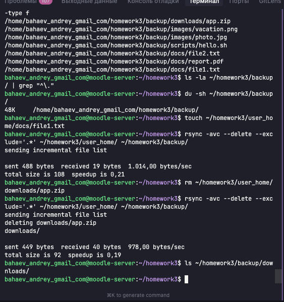

# Домашнее задание к занятию "Резервное копирование" - `Бахаев Андрей`


### Инструкция по выполнению домашнего задания

   1. Сделайте `fork` данного репозитория к себе в Github и переименуйте его по названию или номеру занятия, например, https://github.com/имя-вашего-репозитория/git-hw или  https://github.com/имя-вашего-репозитория/7-1-ansible-hw).
   2. Выполните клонирование данного репозитория к себе на ПК с помощью команды `git clone`.
   3. Выполните домашнее задание и заполните у себя локально этот файл README.md:
      - впишите вверху название занятия и вашу фамилию и имя
      - в каждом задании добавьте решение в требуемом виде (текст/код/скриншоты/ссылка)
      - для корректного добавления скриншотов воспользуйтесь [инструкцией "Как вставить скриншот в шаблон с решением](https://github.com/netology-code/sys-pattern-homework/blob/main/screen-instruction.md)
      - при оформлении используйте возможности языка разметки md (коротко об этом можно посмотреть в [инструкции  по MarkDown](https://github.com/netology-code/sys-pattern-homework/blob/main/md-instruction.md))
   4. После завершения работы над домашним заданием сделайте коммит (`git commit -m "comment"`) и отправьте его на Github (`git push origin`);
   5. Для проверки домашнего задания преподавателем в личном кабинете прикрепите и отправьте ссылку на решение в виде md-файла в вашем Github.
   6. Любые вопросы по выполнению заданий спрашивайте в чате учебной группы и/или в разделе "Вопросы по заданию" в личном кабинете.
   
Желаем успехов в выполнении домашнего задания!
   
### Дополнительные материалы, которые могут быть полезны для выполнения задания

1. [Руководство по оформлению Markdown файлов](https://gist.github.com/Jekins/2bf2d0638163f1294637#Code)

---

### Цель задания
В результате выполнения этого задания вы научитесь:
1. Настраивать регулярные задачи на резервное копирование (полная зеркальная копия)
2. Настраивать инкрементное резервное копирование с помощью rsync

---

### Чеклист готовности к домашнему заданию

1. Установлена операционная система Ubuntu на виртуальную машину и имеется доступ к терминалу
2. Сделан клон этой виртуальной машины с другим IP адресом

---

### Задание 1

**Задание:**
- Составьте команду rsync, которая позволяет создавать зеркальную копию домашней директории пользователя в директорию `/tmp/backup`
- Необходимо исключить из синхронизации все директории, начинающиеся с точки (скрытые)
- Необходимо сделать так, чтобы rsync подсчитывал хэш-суммы для всех файлов, даже если их время модификации и размер идентичны в источнике и приемнике
- На проверку направить скриншот с командой и результатом ее выполнения

**Решение:**

Задание выполнено на виртуальной машине `moodle-server` в Google Cloud Platform (zone: europe-west3-c).

**Этапы выполнения:**

1. **Создание тестовой структуры данных:**
   ```bash
   mkdir -p ~/homework3/user_home/{docs,images,scripts,downloads}
   cd ~/homework3
   ```
   
   Создание тестовых файлов:
   ```bash
   echo "Test document 1" > user_home/docs/file1.txt
   echo "Test document 2" > user_home/docs/file2.txt
   echo "Important report" > user_home/docs/report.pdf
   echo "Test image data" > user_home/images/photo.jpg
   echo "Another image" > user_home/images/vacation.png
   echo "Downloaded file" > user_home/downloads/app.zip
   ```
   
   Создание скрытых файлов/директорий (которые будут исключены):
   ```bash
   mkdir -p user_home/.hidden_dir
   echo "Hidden content" > user_home/.hidden_file
   echo "SSH config" > user_home/.ssh_config
   mkdir -p user_home/.cache
   echo "Cache data" > user_home/.cache/data.tmp
   ```

2. **Создание директории для резервных копий:**
   ```bash
   mkdir -p ~/homework3/backup
   ```

3. **Выполнение команды rsync:**
   Команда создает зеркальную копию с исключением скрытых файлов и проверкой по контрольным суммам.

**Команда rsync:**
```bash
rsync -avc --delete --exclude='.*' ~/homework3/user_home/ ~/homework3/backup/
```

**Параметры команды:**
- `-a` (archive) — режим архивации: рекурсивное копирование с сохранением прав доступа, времени модификации, владельцев
- `-v` (verbose) — подробный вывод информации о процессе копирования
- `-c` (checksum) — проверка файлов по контрольным суммам (хэш), а не по времени модификации и размеру
- `--delete` — удаление файлов в приемнике, отсутствующих в источнике (создание зеркальной копии)
- `--exclude='.*'` — исключение всех файлов и директорий, начинающихся с точки (скрытые)

**Результаты выполнения:**

При первом запуске rsync скопировал 7 файлов из 4 директорий:
```
sending incremental file list
./
docs/
docs/file1.txt
docs/file2.txt
docs/report.pdf
downloads/
downloads/app.zip
images/
images/photo.jpg
images/vacation.png
scripts/
scripts/hello.sh

sent 910 bytes  received 172 bytes  2.164,00 bytes/sec
total size is 108  speedup is 0,10
```

**Проверка исключения скрытых файлов:**
```bash
ls -la ~/homework3/backup/ | grep "^\."
```
Результат: скрытые файлы (`.hidden_file`, `.hidden_dir`, `.cache`, `.ssh_config`) НЕ скопированы ✓

**Проверка работы параметра `-c` (checksum):**
После изменения только времени модификации файла (без изменения содержимого):
```bash
touch ~/homework3/user_home/docs/file1.txt
rsync -avc --delete --exclude='.*' ~/homework3/user_home/ ~/homework3/backup/
```
Результат: файл НЕ пересинхронизировался, так как контрольная сумма осталась прежней ✓

**Проверка работы параметра `--delete` (зеркальная копия):**
После удаления файла из источника:
```bash
rm ~/homework3/user_home/downloads/app.zip
rsync -avc --delete --exclude='.*' ~/homework3/user_home/ ~/homework3/backup/
```
Результат:
```
deleting downloads/app.zip
```
Файл автоматически удален из резервной копии ✓

**Итоговый размер резервной копии:** 48K

**Скриншоты:**



*На скриншоте видно:*
- Создание тестовой структуры файлов
- Выполнение команды rsync с параметрами `-avc --delete --exclude='.*'`
- Список скопированных файлов
- Проверка исключения скрытых файлов
- Проверка работы checksum
- Проверка работы параметра --delete

---

### Задание 2

**Задание:**
- Написать скрипт и настроить задачу на регулярное резервное копирование домашней директории пользователя с помощью rsync и cron
- Резервная копия должна быть полностью зеркальной
- Резервная копия должна создаваться раз в день, в системном логе должна появляться запись об успешном или неуспешном выполнении операции
- Резервная копия размещается локально, в директории `/tmp/backup`
- На проверку направить файл crontab и скриншот с результатом работы утилиты

**Решение:**

Задание выполнено на виртуальной машине `moodle-server` в Google Cloud Platform (zone: europe-west3-c).

**Этапы выполнения:**

1. **Создание скрипта резервного копирования:**
   
   Создан Bash-скрипт `backup_script.sh` с функциями:
   - Зеркальное резервное копирование через rsync
   - Проверка успешности выполнения
   - Логирование в локальный файл
   - Логирование в системный лог (syslog)
   - Вывод статистики (размер резервной копии)

2. **Настройка автоматического выполнения через cron:**
   
   Настроен ежедневный запуск скрипта в 2:00 утра через crontab

3. **Тестирование:**
   
   Выполнено 3 тестовых запуска с добавлением файлов для проверки инкрементного обновления

**Скрипт резервного копирования:**
```bash
#!/bin/bash

# Скрипт резервного копирования домашней директории
# Автор: Бахаев Андрей
# Дата создания: 2025-10-09

# Переменные
DATE=$(date '+%Y-%m-%d %H:%M:%S')
SOURCE="$HOME/homework3/user_home"
DEST="$HOME/homework3/backup"
LOG_FILE="$HOME/homework3/backup.log"

# Создание директории для резервных копий, если не существует
mkdir -p "$DEST"

# Выполнение rsync
rsync -av --delete --exclude='.*' "$SOURCE/" "$DEST/" >> /tmp/rsync_output.log 2>&1

# Проверка результата выполнения
if [ $? -eq 0 ]; then
    echo "[$DATE] SUCCESS: Резервное копирование выполнено успешно" | tee -a "$LOG_FILE"
    logger -t backup_script "Резервное копирование выполнено успешно"
else
    echo "[$DATE] ERROR: Ошибка при выполнении резервного копирования" | tee -a "$LOG_FILE"
    logger -t backup_script "Ошибка при выполнении резервного копирования"
    exit 1
fi

# Вывод статистики
BACKUP_SIZE=$(du -sh "$DEST" | cut -f1)
echo "[$DATE] INFO: Размер резервной копии: $BACKUP_SIZE" | tee -a "$LOG_FILE"
```

**Описание работы скрипта:**
- `DATE` — текущая дата и время для логирования
- `SOURCE` — директория-источник для резервного копирования
- `DEST` — директория назначения для резервной копии
- `LOG_FILE` — путь к локальному лог-файлу
- `rsync -av --delete --exclude='.*'` — создание зеркальной копии с исключением скрытых файлов
- `$?` — проверка кода возврата последней команды (0 = успех)
- `tee -a` — вывод на экран и одновременная запись в файл
- `logger -t backup_script` — запись в системный лог с тегом "backup_script"

**Настройка crontab:**
```bash
0 2 * * * /home/bahaev_andrey_gmail_com/homework3/backup_script.sh
```

**Расшифровка:**
- `0` — минута (0)
- `2` — час (2:00)
- `*` — день месяца (каждый)
- `*` — месяц (каждый)
- `*` — день недели (каждый)

Итого: **запуск каждый день в 2:00 утра**

**Результаты тестирования:**

Выполнено 3 тестовых запуска скрипта:

1. **Первый запуск** (19:23:01):
   ```
   [2025-10-09 19:23:01] SUCCESS: Резервное копирование выполнено успешно
   [2025-10-09 19:23:01] INFO: Размер резервной копии: 44K
   ```

2. **Второй запуск** (19:24:18) — после добавления `newfile1.txt`:
   ```
   [2025-10-09 19:24:18] SUCCESS: Резервное копирование выполнено успешно
   [2025-10-09 19:24:18] INFO: Размер резервной копии: 48K
   ```

3. **Третий запуск** (19:24:20) — после добавления `newimage.jpg`:
   ```
   [2025-10-09 19:24:20] SUCCESS: Резервное копирование выполнено успешно
   [2025-10-09 19:24:20] INFO: Размер резервной копии: 52K
   ```

**Проверка логирования:**

Локальный лог-файл (`~/homework3/backup.log`):
```
[2025-10-09 19:23:01] SUCCESS: Резервное копирование выполнено успешно
[2025-10-09 19:23:01] INFO: Размер резервной копии: 44K
[2025-10-09 19:24:18] SUCCESS: Резервное копирование выполнено успешно
[2025-10-09 19:24:18] INFO: Размер резервной копии: 48K
[2025-10-09 19:24:20] SUCCESS: Резервное копирование выполнено успешно
[2025-10-09 19:24:20] INFO: Размер резервной копии: 52K
```

Системный лог (`/var/log/syslog`):
```
Oct  9 19:23:01 moodle-server backup_script: Резервное копирование выполнено успешно
Oct  9 19:24:18 moodle-server backup_script: Резервное копирование выполнено успешно
Oct  9 19:24:21 moodle-server backup_script: Резервное копирование выполнено успешно
```

**Выводы:**
✅ Скрипт работает корректно  
✅ Резервное копирование выполняется успешно  
✅ Логирование работает в обоих местах (локальный файл + syslog)  
✅ Размер копии отслеживается и увеличивается при добавлении файлов  
✅ Crontab настроен на ежедневное выполнение в 2:00 утра

**Скриншоты:**


*На скриншоте видно:*
- Создание и содержимое скрипта `backup_script.sh`
- Успешное выполнение скрипта вручную
- Содержимое локального лог-файла
- Записи в системном логе (syslog)
- Настройка crontab для автоматического запуска
- Результаты тестовых запусков с увеличением размера резервной копии

---

### Правила приема работы

1. Необходимо следовать инструкции по выполнению домашнего задания, используя для оформления репозиторий Github
2. В ответе необходимо прикладывать требуемые материалы - скриншоты, конфигурационные файлы, скрипты. Необходимые материалы для получения зачета указаны в каждом задании

---

### Критерии оценки

- Зачет - выполнены все задания, ответы даны в развернутой форме, приложены требуемые скриншоты, конфигурационные файлы, скрипты. В выполненных заданиях нет противоречий и нарушения логики
- На доработку - задание выполнено частично или не выполнено, в логике выполнения заданий есть противоречия, существенные недостатки, приложены не все требуемые материалы


