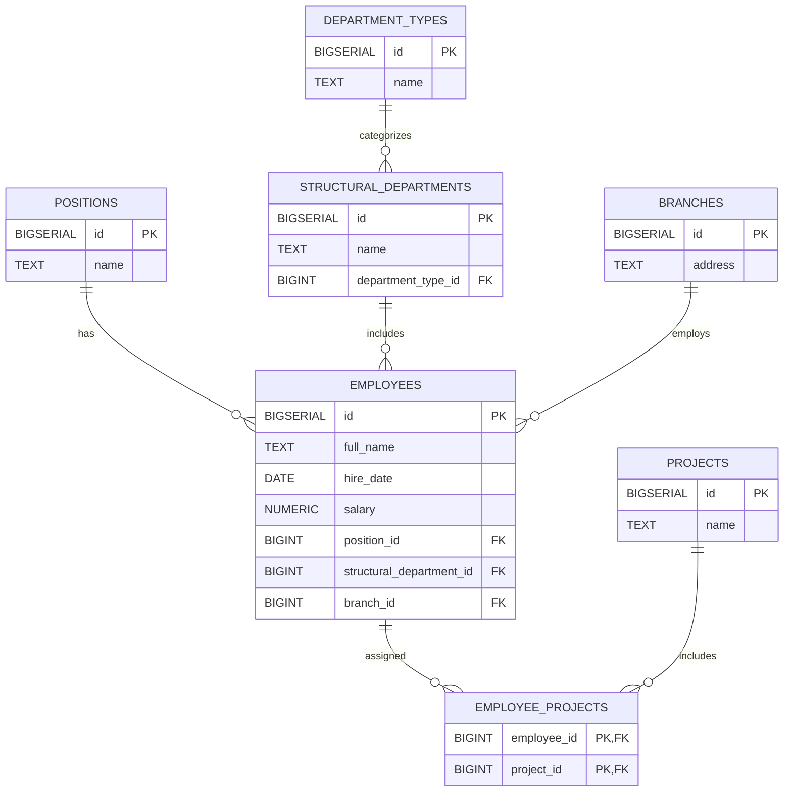

```mermaid
erDiagram
    EMPLOYEES {
        BIGSERIAL id PK
        TEXT full_name
        DATE hire_date
        NUMERIC salary
        BIGINT position_id FK
        BIGINT structural_department_id FK
        BIGINT branch_id FK
    }

    POSITIONS {
        BIGSERIAL id PK
        TEXT name
    }

    DEPARTMENT_TYPES {
        BIGSERIAL id PK
        TEXT name
    }

    STRUCTURAL_DEPARTMENTS {
        BIGSERIAL id PK
        TEXT name
        BIGINT department_type_id FK
    }

    BRANCHES {
        BIGSERIAL id PK
        TEXT address
    }

    PROJECTS {
        BIGSERIAL id PK
        TEXT name
    }

    EMPLOYEE_PROJECTS {
        BIGINT employee_id PK, FK
        BIGINT project_id PK, FK
    }

    POSITIONS ||--o{ EMPLOYEES : has
    DEPARTMENT_TYPES ||--o{ STRUCTURAL_DEPARTMENTS : categorizes
    STRUCTURAL_DEPARTMENTS ||--o{ EMPLOYEES : includes
    BRANCHES ||--o{ EMPLOYEES : employs
    EMPLOYEES ||--o{ EMPLOYEE_PROJECTS : assigned
    PROJECTS ||--o{ EMPLOYEE_PROJECTS : includes
```
