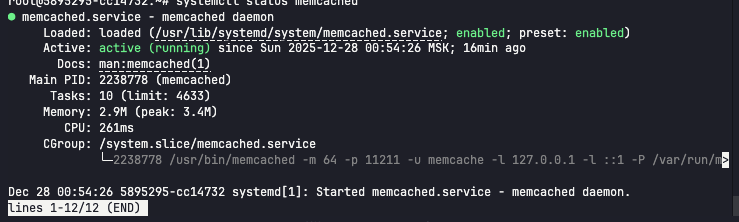
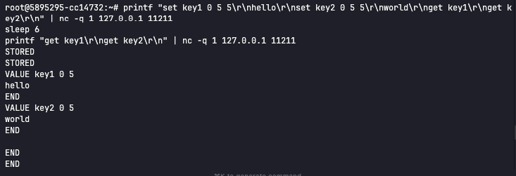
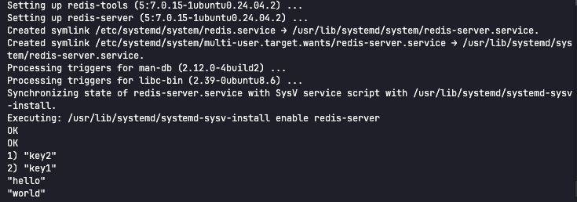
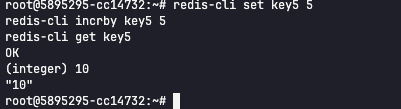

# Домашнее задание к занятию «Кеширование Redis/memcached»

## Описание
Выполнены задания по кешированию, работе с Memcached и Redis:

1. Примеры проблем, которые решает кеширование.
2. Установка и запуск Memcached.
3. Удаление ключей по TTL в Memcached.
4. Запись и чтение данных в Redis.
5. *Дополнительно:* работа с числовыми ключами в Redis.

## Задания и ответы

### Задание 1. Кеширование
**Текст задания:** Приведите примеры проблем, которые может решить кеширование.

**Ответ:**  
- Ускоряет повторные запросы (например, карточки товаров).  
- Снижает нагрузку на базу данных и внешние API.  
- Помогает выдерживать всплески трафика.  
- Уменьшает задержки в системе.  

**Команды:**  
```bash
# Команды не требуются
```

---

### Задание 2. Memcached
**Текст задания:** Установите и запустите memcached. Приведите скриншот `systemctl status memcached`, где будет видно, что memcached запущен.

**Ответ:** Memcached установлен и запущен.  

**Команды:**
```bash
apt update
apt install -y memcached libmemcached-tools
systemctl enable --now memcached
systemctl status memcached
```



**Результат:**  
- ✅ Сервис `memcached` активен и работает  

---

### Задание 3. Удаление по TTL в Memcached
**Текст задания:** Запишите в memcached несколько ключей с любыми именами и значениями, для которых выставлен TTL 5. Приведите скриншот, на котором видно, что спустя 5 секунд ключи удалились из базы.

**Ответ:** Ключи записаны с TTL 5 секунд, после ожидания удаляются.  

**Команды:**
```bash
printf "set key1 0 5 5\r\nhello\r\nset key2 0 5 5\r\nworld\r\nget key1\r\nget key2\r\n" | nc -q 1 127.0.0.1 11211
sleep 6
printf "get key1\r\nget key2\r\n" | nc -q 1 127.0.0.1 11211
```



**Результат:**  
- ✅ Ключи исчезают после истечения TTL  

---

### Задание 4. Запись данных в Redis
**Текст задания:** Запишите в Redis несколько ключей с любыми именами и значениями. Через `redis-cli` достаньте все записанные ключи и значения из базы, приведите скриншот этой операции.

**Ответ:** Ключи записаны и прочитаны через `redis-cli`.  

**Команды:**
```bash
apt install -y redis-server
systemctl enable --now redis-server
redis-cli set key1 "hello"
redis-cli set key2 "world"
redis-cli keys "*"
redis-cli get key1
redis-cli get key2
```



**Результат:**  
- ✅ Видны ключи и значения в Redis  

---

### Задание 5*. Работа с числами
**Текст задания:** Запишите в Redis ключ `key5` со значением типа "int" равным числу 5. Увеличьте его на 5, чтобы в итоге в значении лежало число 10. Приведите скриншот, где будут проделаны все операции и будет видно, что значение `key5` стало равно 10.

**Ответ:** Ключ `key5` увеличен с 5 до 10.  

**Команды:**
```bash
redis-cli set key5 5
redis-cli incrby key5 5
redis-cli get key5
```



**Результат:**  
- ✅ Значение `key5` равно 10  
