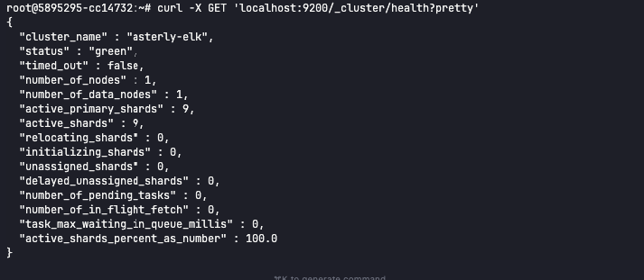
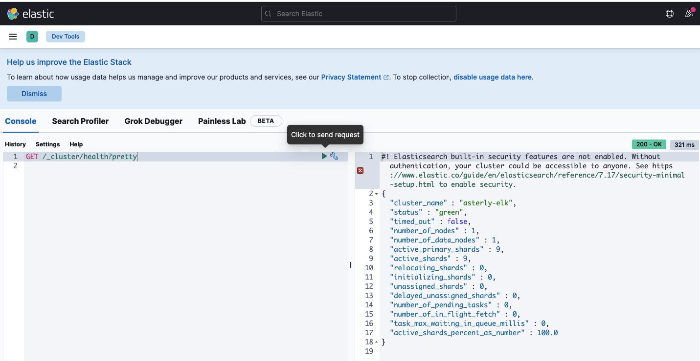
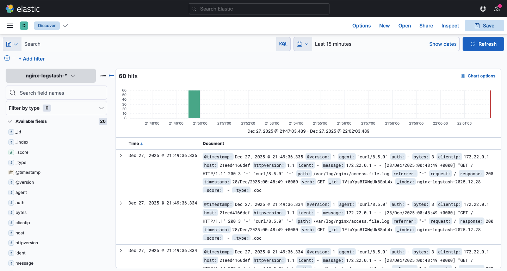
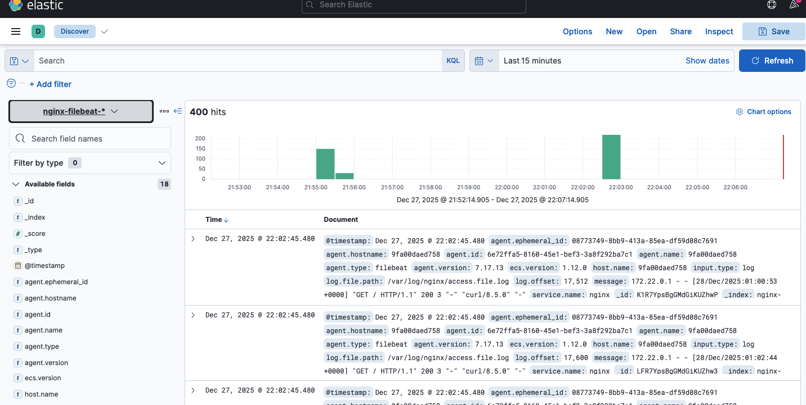

# Домашнее задание к занятию «ELK»

## Описание
Задания по установке и настройке стека ELK (Elasticsearch, Kibana, Logstash, Filebeat) и отправке логов в Elasticsearch.

## Файлы
- `docker-compose.logstash.yml` — стек ELK + Logstash + Nginx.
- `docker-compose.filebeat.yml` — стек ELK + Filebeat + Nginx.
- `logstash/pipeline/logstash.conf` — pipeline для Logstash.
- `filebeat/filebeat.yml` — конфигурация Filebeat.
- `nginx/nginx.conf` — Nginx пишет access-лог в файл `access.file.log`.

## Задания и ответы

### Задание 1. Elasticsearch
**Текст задания:** Установите и запустите Elasticsearch, после чего поменяйте параметр `cluster_name` на случайный.  
Приведите скриншот команды `curl -X GET 'localhost:9200/_cluster/health?pretty'`, где будет виден нестандартный `cluster_name`.

**Ответ:** Elasticsearch установлен и запущен. Параметр `cluster_name` изменен на `asterly-elk` в docker-compose файле. Кластер работает в статусе `green`.

**Команды:**
```bash
sysctl -w vm.max_map_count=262144
echo 'vm.max_map_count=262144' > /etc/sysctl.d/99-elasticsearch.conf

docker compose -f docker-compose.logstash.yml up -d
sleep 20
curl -X GET 'localhost:9200/_cluster/health?pretty'
```

**Скриншот:**  


**Результат:**  
- ✅ Elasticsearch запущен с нестандартным именем кластера `asterly-elk`  
- ✅ Статус кластера: `green` (все узлы работают)

---

### Задание 2. Kibana
**Текст задания:** Установите и запустите Kibana.  
Приведите скриншот интерфейса Kibana на странице `http://<ip_сервера>:5601/app/dev_tools#/console`,
где выполнен запрос `GET /_cluster/health?pretty`.

**Ответ:** Kibana установлен и запущен. Через Dev Tools выполнен запрос к Elasticsearch, получен статус кластера.

**Команды:**
```bash
GET /_cluster/health?pretty
```

**Скриншот:**  


**Результат:**  
- ✅ Kibana доступен на порту 5601  
- ✅ Dev Tools работает, запрос к Elasticsearch выполнен успешно

---

### Задание 3. Logstash
**Текст задания:** Установите и запустите Logstash и Nginx.  
С помощью Logstash отправьте access-лог Nginx в Elasticsearch.  
Приведите скриншот интерфейса Kibana, на котором видны логи Nginx.

**Ответ:** Logstash и Nginx установлены и запущены. Logstash настроен на чтение access-логов Nginx из файла `/var/log/nginx/access.file.log`, парсинг через Grok и отправку в Elasticsearch с индексом `nginx-logstash-*`. Логи успешно отображаются в Kibana.

**Команды:**
```bash
docker compose -f docker-compose.logstash.yml up -d
for i in {1..5}; do curl -s http://localhost:8081 >/dev/null; done
# Логи доступны в Kibana (Discover) по индексу nginx-logstash-*
```

**Скриншот:**  


**Результат:**  
- ✅ Logstash читает логи Nginx из файла  
- ✅ Логи парсятся через Grok паттерн `COMBINEDAPACHELOG`  
- ✅ Данные отправляются в Elasticsearch с индексом `nginx-logstash-*`  
- ✅ Логи отображаются в Kibana Discover

---

### Задание 4. Filebeat
**Текст задания:** Установите и запустите Filebeat.  
Переключите поставку логов Nginx с Logstash на Filebeat.  
Приведите скриншот интерфейса Kibana, на котором видны логи Nginx,
которые были отправлены через Filebeat.

**Ответ:** Filebeat установлен и запущен. Конфигурация Filebeat настроена на чтение access-логов Nginx и отправку напрямую в Elasticsearch с индексом `nginx-filebeat-*`. Логи успешно отображаются в Kibana. Filebeat работает легче и быстрее, чем Logstash для простых задач сбора логов.

**Команды:**
```bash
docker compose -f docker-compose.logstash.yml down
docker compose -f docker-compose.filebeat.yml up -d
for i in {1..5}; do curl -s http://localhost:8081 >/dev/null; done
# Логи доступны в Kibana (Discover) по индексу nginx-filebeat-*
```

**Скриншот:**  


**Результат:**  
- ✅ Filebeat читает логи Nginx из файла  
- ✅ Данные отправляются в Elasticsearch с индексом `nginx-filebeat-*`  
- ✅ Логи отображаются в Kibana Discover  
- ✅ Filebeat работает стабильно и потребляет меньше ресурсов, чем Logstash

---