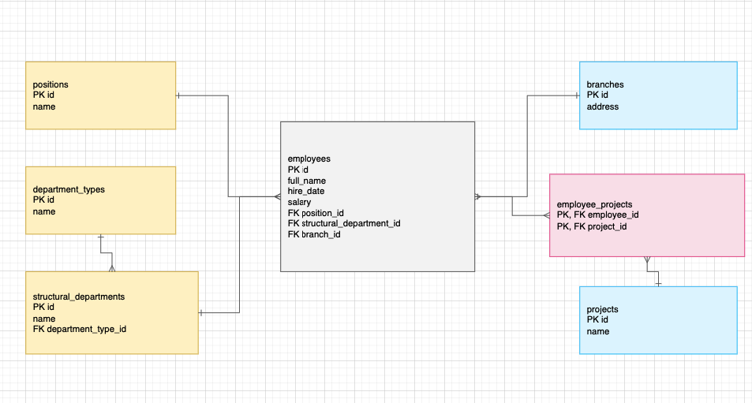

# Домашнее задание к занятию «Базы данных» - `Бахаев Андрей`
---

## Описание
Задания по проектированию базы данных на основе отчёта в формате Excel. Необходимо выделить сущности, определить типы данных для PostgreSQL, создать схему модели данных с указанием связей между таблицами.

## Файлы
- `hw-12-1.xlsx` — исходный файл с данными отчёта
- `hw-12-1.csv` — экспорт данных в CSV
- `diagram.drawio` — исходник схемы базы данных (draw.io)
- `diagram.md` — описание схемы в формате Mermaid
- `diagrams.png` — скриншот схемы базы данных

## Задания и ответы

### Задание 1
**Текст задания:** Опишите не менее семи таблиц, из которых состоит база данных. Определите, какие данные хранятся в этих таблицах и тип данных у столбцов в PostgreSQL. Начертите схему модели данных.

**Ответ:** На основе исходного файла выделил сущности сотрудников, должностей, подразделений, филиалов и проектов. В поле «Проект на который назначен» встречаются несколько значений, поэтому связь сотрудник–проект делаю многие-ко-многим.

**Таблицы и поля (PostgreSQL):**

1) `employees` — сотрудники
   - `id` `bigserial` PRIMARY KEY
   - `full_name` `text` — ФИО сотрудника
   - `hire_date` `date` — дата найма
   - `salary` `numeric(12,2)` — оклад
   - `position_id` `bigint` REFERENCES `positions(id)`
   - `structural_department_id` `bigint` REFERENCES `structural_departments(id)`
   - `branch_id` `bigint` REFERENCES `branches(id)`

2) `positions` — должности
   - `id` `bigserial` PRIMARY KEY
   - `name` `text` UNIQUE

3) `department_types` — типы подразделений
   - `id` `bigserial` PRIMARY KEY
   - `name` `text` UNIQUE

4) `structural_departments` — структурные подразделения
   - `id` `bigserial` PRIMARY KEY
   - `name` `text` UNIQUE
   - `department_type_id` `bigint` REFERENCES `department_types(id)`

5) `branches` — филиалы/адреса
   - `id` `bigserial` PRIMARY KEY
   - `address` `text` UNIQUE

6) `projects` — проекты
   - `id` `bigserial` PRIMARY KEY
   - `name` `text` UNIQUE

7) `employee_projects` — назначение сотрудников на проекты (связь M:N)
   - `employee_id` `bigint` REFERENCES `employees(id)`
   - `project_id` `bigint` REFERENCES `projects(id)`
   - PRIMARY KEY (`employee_id`, `project_id`)

**Связи между таблицами:**
- `department_types` 1 → N `structural_departments`
- `structural_departments` 1 → N `employees`
- `positions` 1 → N `employees`
- `branches` 1 → N `employees`
- `employees` N ↔ N `projects` через `employee_projects`

**Скриншот:**  

**Результат:**  
- ✅ Выделено 7 таблиц с корректными типами данных PostgreSQL  
- ✅ Определены первичные ключи для всех таблиц  
- ✅ Настроены связи между таблицами (1:N и M:N)  
- ✅ Создана схема базы данных с отображением всех таблиц, столбцов и связей
